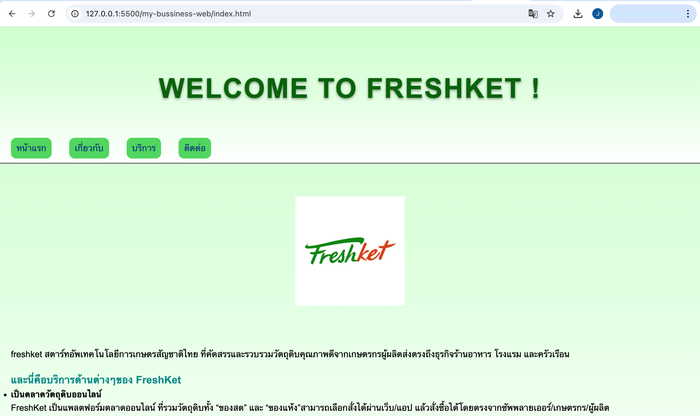
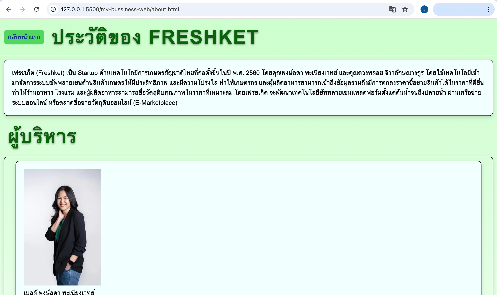
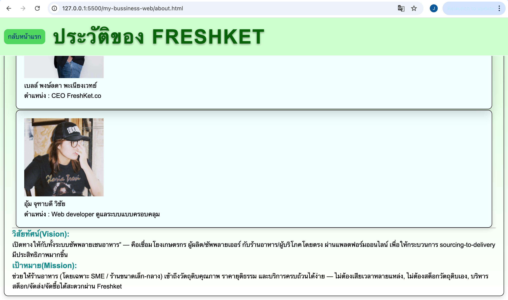
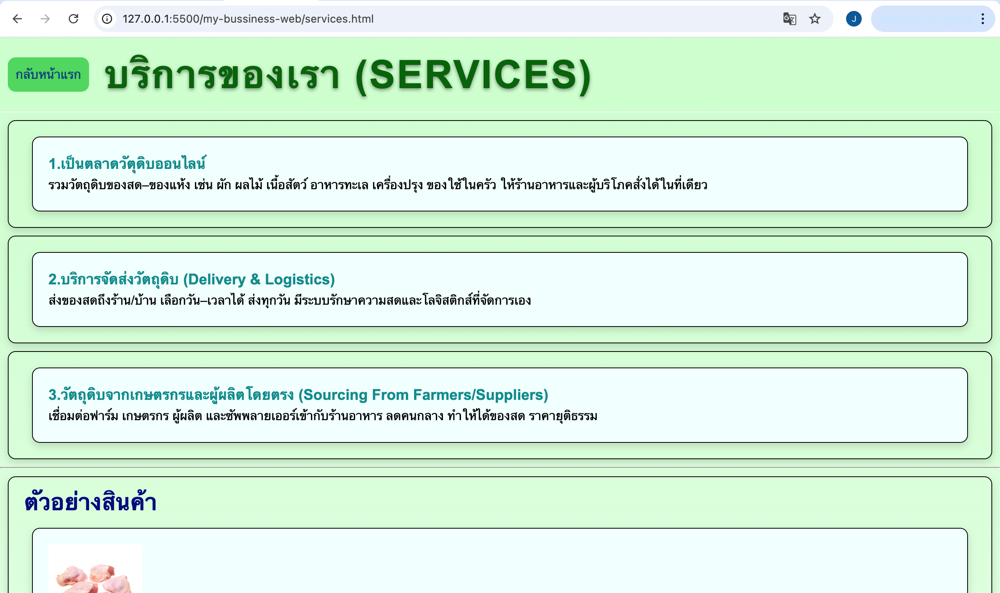
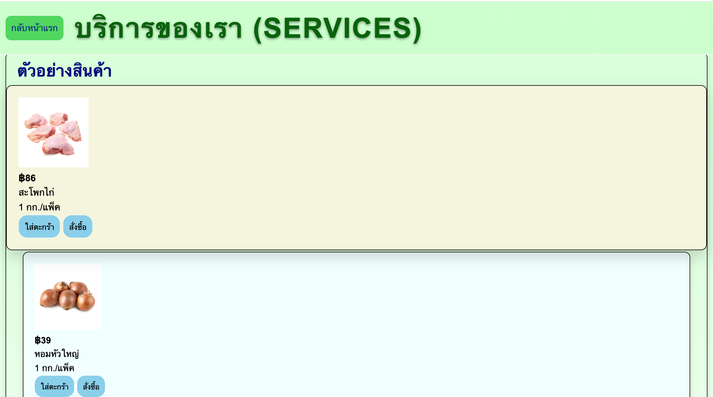
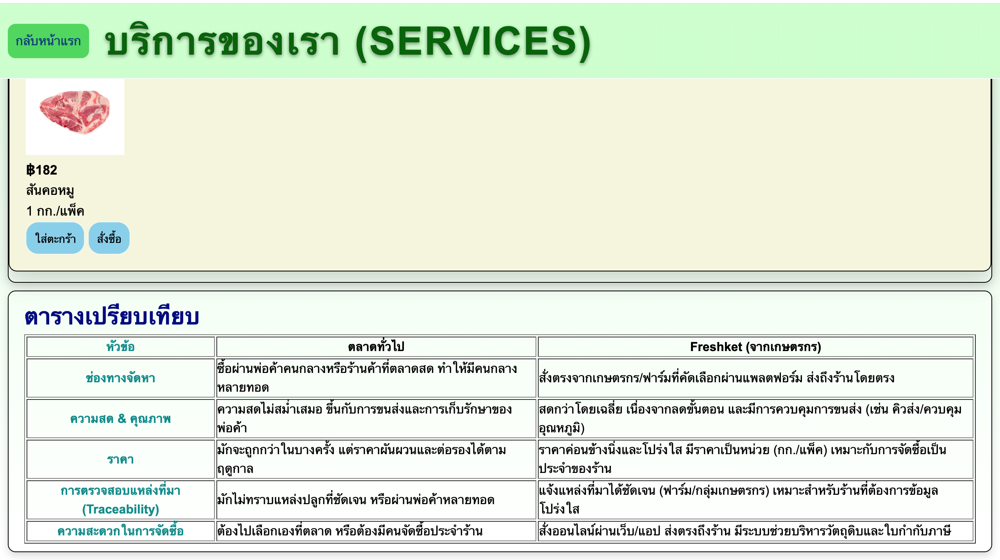
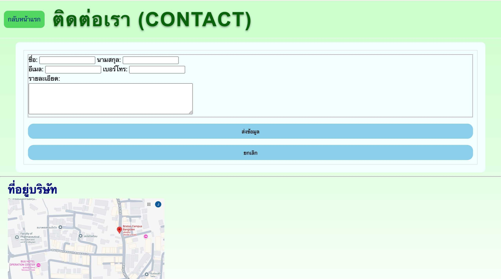
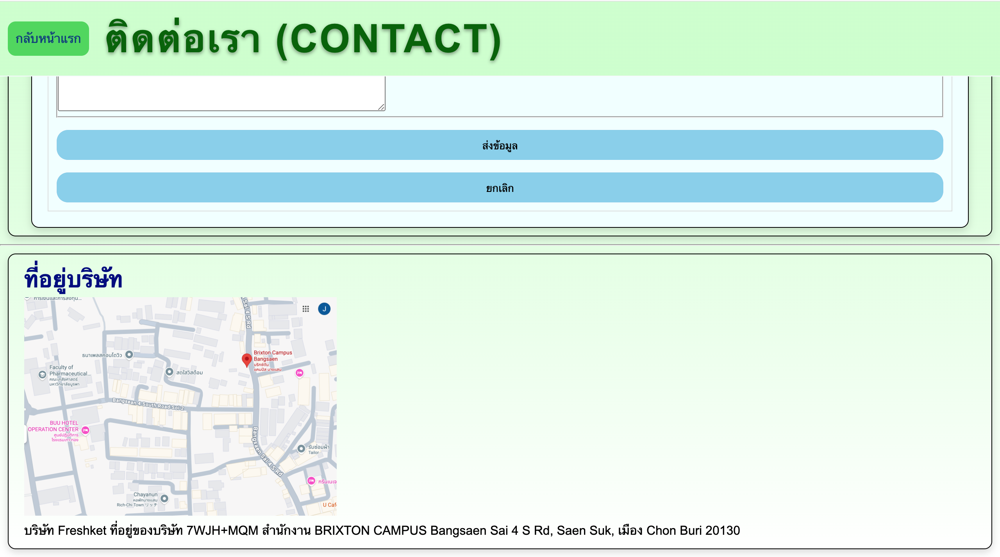

# Freshket Website

เป็นโปรเจคที่แนะนำเว็บไซต์เกี่ยวกับธุรกิจการเลือกซื้ออาหารโดยทำหน้าที่เป็นตัวกลางจัดซื้อจัดหาวัตถุดิบจากเกษตรกรและซัพพลายเออร์โดยตรง

# จุดประสงค์ของ Freshket

เว็บนี้สร้างขึ้นเพื่อสร้างขึ้นเพื่อ “แก้ปัญหาในห่วงโซ่อาหาร” ระหว่าง เกษตรกร – ผู้ผลิต – ร้านอาหาร/โรงแรม โดยมีเป้าหมายหลักคือทำให้การซื้อวัตถุดิบสดเป็นเรื่องง่ายขึ้น โปร่งใสขึ้น และราคายุติธรรมขึ้น

# โครงสร้างของ website

```text
my-business-web/
├── index.html (Homepage)
├── about.html (About Page)
├── services.html (Services Page)
├── contact.html (Contact Page)
├── styles.css
├── images/
│ ├── logo.webp
│ ├── index.png
│ ├── service1.png
│ ├── service2.png
│ ├── service3.png
│ ├── contact1.png
│ ├── contact2.png
│ └── ... (อื่นๆ)
├── README.md
└── .gitignore
```

# ลิงก์เข้าสู่หน้าต่างๆ

[หน้าแรก](index.html)


[เกี่ยวกับเรา](about.html)



[บริการของเรา](services.html)




[ติดต่อเรา](contact.html)



```

```
